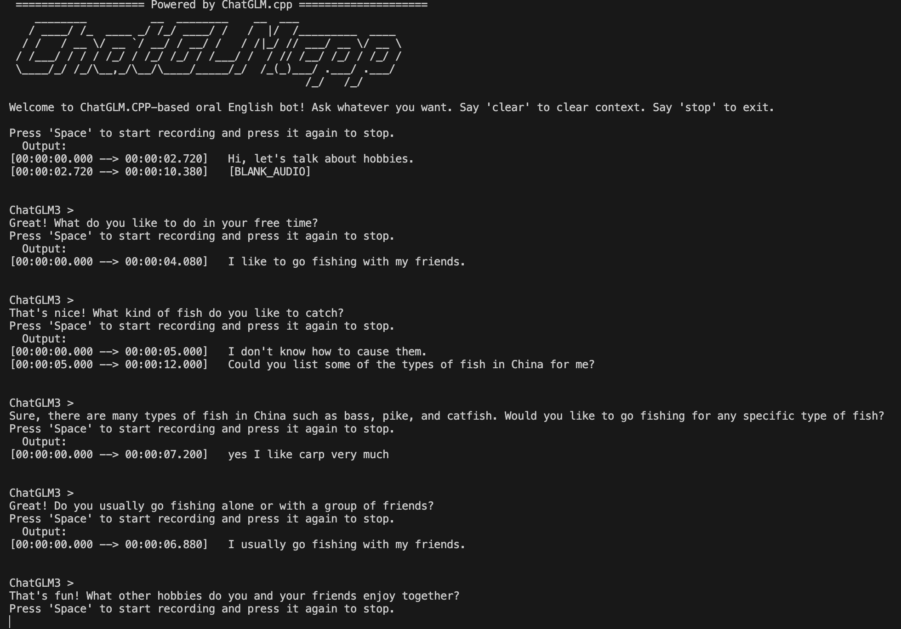

##  SpeakEasy 
[English Version](README_en.md)

欢迎来到SpeakEasy，这是一个简单而实用的项目，通过结合现成的LLM模型、自动语音识别（ASR）和文本转语音（TTS）方法，创建了一个交互式口语聊天机器人。

通过与LLM模型对话，您可以提升口语英语能力。它可以在您的笔记本电脑或个人电脑上实时且完全在离线状态下运行(GPU或性能较好的纯CPU)。

测试机器：M2 16G MacBook Air / (4070Ti) + 13600KF Ubuntu / (4070Ti) + 13600KF Windows)



## 特点
- 通过互动对话练习口语英语
- 实时和离线功能
- 使用[ChatGLM3](https://github.com/THUDM/ChatGLM3) 6B 4比特量化模型进行聊天交互
- 使用[whisper.cpp](https://github.com/ggerganov/whisper.cpp)加速自动语音识别（ASR）
- 使用[EfficientSpeech](https://github.com/roatienza/efficientspeech)进行文本转语音转换

## 使用方法
- 根据[Chatglm.cpp](chatglm.cpp.md)安装Chatglm.cpp
- 下载ChatGLM3 6B-4bit模型 [model](https://huggingface.co/Xorbits/chatglm3-6B-GGML)
- 安装 [whisper.cpp](https://github.com/ggerganov/whisper.cpp) 尽量选择BLAS编译，加速推理速度
- 安装 [EfficientSpeech](./examples/efficientspeech/README.md)
- 安装相关依赖
`pip install -r requirements.txt`
- 创建本地文字转语音服务（TTS）
`cd examples/efficientspeech/ && sh es_tts_service.sh`
- 修改模型存储路径并运行脚本
    ```
    vim examples/demo.sh 
    cd examples && sh demo.sh
    ```

#### 小贴士
- 按空格键录音，再按一次结束
- 如果输入音频的设备不是你的电脑内置的输入，修改 `--input-device` 为你真实音频输入设备（如耳机、麦克风）的index，可以通过以下代码查看
  ```
  import sounddevice as sd
  input_devices = sd.query_devices(kind='input')
  ```

## 鸣谢
该项目主要在[Chatglm.cpp](https://github.com/li-plus/chatglm.cpp)基础上进行魔改。


