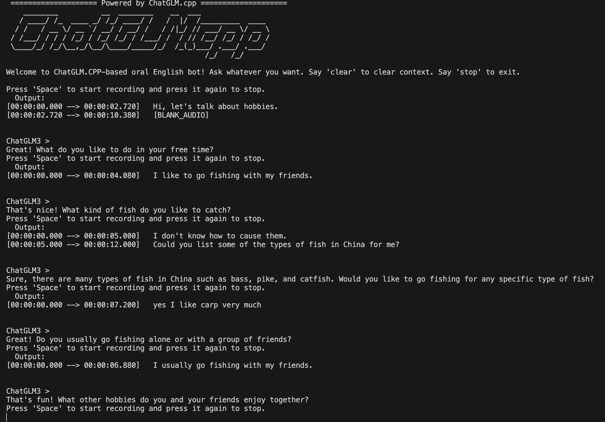

##  SpeakEasy 
[中文版本](README.md)


Welcome to SpeakEasy, a simple yet useful project that combines off-the-shelf LLM models, automatic speech recognition (ASR), and text-to-speech (TTS) methods to create an interactive spoken chatbot. 

With SpeakEasy, you can enhance your oral English skills by engaging in conversations with the LLM model. It operates in real-time and offline on your laptop or PC. 

Tested on M2 16G MacBook Air / (4070Ti) + 13600KF Ubuntu / (4070Ti) + 13600KF Windows.



## Features
- Practice oral English through interactive conversations
- Real-time and offline functionality
- Utilizes [ChatGLM3](https://github.com/THUDM/ChatGLM3) 6B 4-bit quantized model for chat interactions
- Accelerated automatic speech recognition (ASR) with [whisper.cpp](https://github.com/ggerganov/whisper.cpp)
- Text-to-speech (TTS) conversion using [TTS](https://github.com/coqui-ai/TTS)

## Usage
1. Follow the README of [Chatglm.cpp](chatglm.cpp.md) to install chatglm.cpp
2. Download ChatGLM3 6B-4bit [model](https://huggingface.co/Xorbits/chatglm3-6B-GGML)
3. Install [whisper.cpp](https://github.com/ggerganov/whisper.cpp) and compile with BLAS / CUBLAS can speed up the inference process
4. Install requirements
`pip install -r requirements.txt`
5. Modify the model path of the script and run it:
    ```
    vim examples/demo.sh 
    cd examples && sh demo.sh
    ```

#### Tips
- Press 'SPACE' key to start recording your voice, and press it again to finish.
- If the input device is not your build-in device, modify the `--input-device` to your real input device index. Find the right device index via:
  ```
  import sounddevice as sd
  input_devices = sd.query_devices(kind='input')
  ```

## Credits
- This project is greatly inspired by [Chatglm.cpp](https://github.com/li-plus/chatglm.cpp).
